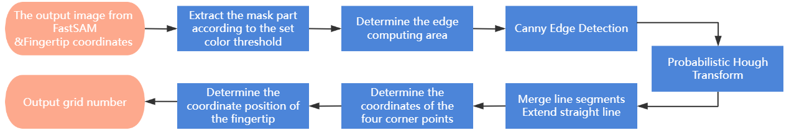

# Project-Course-SUPSI
## Human-Centric Integration of Extended Reality Technologies in Industry 5.0: A Comprehensive Review for Manufacturing
[PDF](https://github.com/Avalon-S/Project-Course-SUPSI/blob/master/Report/Literature_Review_Human-Centric_Integration_of_Extended_Reality_Technologies_in_Industry_5.0.pdf)
## Augmented Reality-Driven Robotic Arm Control for Industrial Automation
[PDF](https://github.com/Avalon-S/Project-Course-SUPSI/blob/master/Report/Project%20Report_Augmented%20Reality-Driven%20Robotic%20Arm%20Control%20for%20Industrial%20Automation.pdf)
### Motivation
1)	In industrial manufacturing, where a wide variety of products are produced, traditional segmentation methods often require separate model training for each product or part. Applying these methods to complex industrial processes is challenging, as it is not feasible to collect data and train specific models for each operational process, which would be resource-intensive. **Can this project achieve its task without using any datasets specifically tailored to the scene?**
2)	Industrial environments often involve complex interaction tasks. **Can an AR-based system provide a more intuitive, straightforward, and "what-you-see-is-what-you-get" interactive experience?**

### Project Structure
1. **Gesture Recognition**: The **YOLOv8** model is used to recognize user gestures, which trigger the part segmentation process.

2. **Part Segmentation**: **FastSAM** segments the white tray and its black parts, mapping the spatial coordinates to the robotic arm.

3. **Control Interface**: The AR interface allows users to directly select parts via gesture or AR buttons to initiate the robotic arm's picking actions.

#### System Architecture

#### Segmentation Workflow

#### Parts Tray and Grid Mapping

#### AR-based Picking System

### Environment Configuration
#### YOLOv8 Fine-tuning
- **Operating System**: Ubuntu 22.04
- **CPU**: Intel(R) Xeon(R) Platinum 8255C
- **GPU**: NVIDIA RTX 2080 Ti (12 GB)
- **Memory**: 43GB
- **Python**: `3.12`
- **Key Dependencies**:
  - **Pytorch**: `2.3+cu121`
  - **ultralytics**: `ultralytics 8.2.87`
- **DataSet**: [Multi-gesture Language Detection Dataset](https://universe.roboflow.com/christ-university-ilp52/multiple-sign-language-detection)
#### FastSAM
- **Operating System**: Windows 11 Home
- **CPU**:   Intel(R)  Core(TM) i7-14700HX @2.1GHZ
- **GPU**:   NVIDIA  GeForce RTX 4070 Laptop GPU 
- **Memory**: 32 GB
- **FastSAM**: Install from [FastSAM Repository](https://github.com/CASIA-IVA-Lab/FastSAM), Model Weight: [FastSAM-x](https://drive.google.com/file/d/1m1sjY4ihXBU1fZXdQ-Xdj-mDltW-2Rqv/view)
- **Python**: `3.9.19`
- **Key Dependencies**:
  - **Pytorch**: `2.4.1+cu124`
  - **ultralytics**: `ultralytics 8.2.99`
#### AR Development [Install](https://learn.microsoft.com/en-us/windows/mixed-reality/develop/development)
- **AR Device**: Microsoft HoloLens 2
- **Unity**: `2022.3.44f1`
- **Visual Studio**: `2022`
- **Mixed Reality Feature Tool for Unity **: `1.0.2209.0`
- **Mixed Reality OpenXR Plugin**:   `1.11.1`
- **MRTK Graphic Tools **: `0.7.1`
## Acknowledgements
This project was made possible thanks to the open-source **FastSAM** model for image segmentation. I appreciate the contributions of the developers at [CASIA-IVA-Lab](https://github.com/CASIA-IVA-Lab) and other open-source communities for their efforts in advancing  technologies.
